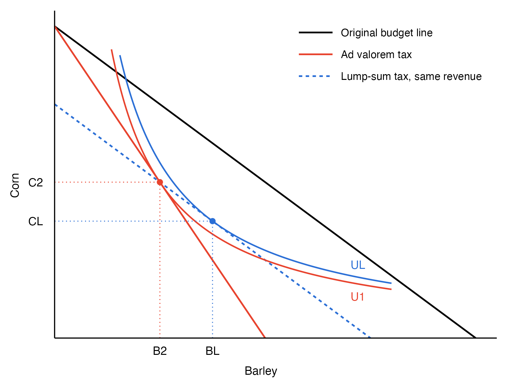

---
format:
  revealjs:
    theme: [default, hygge.scss]
    css: captions.css
    center-title-slide: false
    slide-number: true
    height: 900
    width: 1600
    chalkboard:
      theme: whiteboard
      src: drawings.json
editor: visual
---

<h1>Taxation and Efficiency</h1>

<h2>EC313 - Public Economics: Taxation</h2>

<h2>Justin Smith</h2>

<h2>Wilfrid Laurier University</h2>

<h2>Fall 2026</h2>

{.absolute top="275" left="900" width="550"}

# Goals of This Section

## Goals of This Section

In this section we will:

- Discuss the effects of price changes on consumer behaviour
- Introduce the concept of [excess burden]{.fg style="color: #2780e3;"} of a tax
- Show how to measure excess burden using [indifference curves]{.fg style="color: #2780e3;"}
- Show how to measure excess burden using [demand/supply curves]{.fg style="color: #2780e3;"}
- Show equivalent interpretation with [elasticities]{.fg style="color: #2780e3;"}
- Discuss factors that affect excess burden

# Excess Burden of a Tax with Indifference Curves

## Introduction

- Governments levy taxes mainly to raise revenue to fund public goods and services
- Taxes can impose different types of costs on consumers
  - [Direct cost]{.fg style="color: #555;"}: sending money to the government
  - [Behavioural cost]{.fg style="color: #555;"}: taxes can distort behaviour because of changes in prices
    - Without taxes consumers make choices about consumption
    - Taxes force them to substitute away from the taxed good and make sub-optimal choices
- Ideally a tax imposes the least possible cost in order to raise revenue
  - When the cost exceeds the revenue raised, the difference is the [excess burden]{.fg style="color: #2780e3;"}
    - Also called the *welfare cost* or *deadweight loss* of the tax

## Ad Valorem Tax on Consumers

- Below we will see what happens when an [ad valorem tax]{.fg style="color: #2780e3;"} is imposed on one good
  - An ad valorem tax is a percentage tax on the price of a good
  - For example, a 10% sales tax on a \$1 item means the consumer pays \$1.10
- We will use indifference curves and budget constraints to analyze the effects of the tax
- We will then compare to a [lump-sum tax]{.fg style="color: #2780e3;"}

::: {.callout-note}
## Key Insight
[Ad valorem taxes]{.fg style="color: #2780e3;"} that distort behaviour create excess burden. [Lump-sum taxes]{.fg style="color: #2780e3;"} that do not distort behaviour do not create excess burden. The difference is due to the distortionary effect of changing relative prices with ad valorem taxes.
:::

## Ad Valorem Tax on Consumers

:::::: columns
:::: {.column width="50%"}
::: {layout="[[-1], [1], [-1]]"}

:::
::::

::: {.column width="50%"}
- Graph shows consumption decision for barley and corn
- Initially prices are $P_{B}$ and $P_{C}$
- Budget constraint is $I = P_{B}B + P_{C}C$
- To plot budget constraint, put $C$ on left side

$$C = \frac{I}{P_{C}} - \frac{P_{B}}{P_{C}}B$$

- Slope of budget constraint is $-\frac{P_{B}}{P_{C}}$
- Intercepts are $\frac{I}{P_{C}}$ and $\frac{I}{P_{B}}$
- Optimal consumption bundle is $B_1$ and $C_1$
:::
::::::

## Ad Valorem Tax on Consumers

:::::: columns
:::: {.column width="50%"}
::: {layout="[[-1], [1], [-1]]"}

:::
::::

::: {.column width="50%"}
- An ad valorem tax of $t$ on barley is imposed
- Price of barley rises to $P_{B}(1+t)$
- New budget constraint is $I = P_{B}(1+t)B + P_{C}C$
- Rearranging gives

$$C = \frac{I}{P_{C}} - \frac{P_{B}(1+t)}{P_{C}}B$$

- Slope of new budget constraint is $-\frac{P_{B}(1+t)}{P_{C}}$
- Intercepts are $\frac{I}{P_{C}}$ and $\frac{I}{P_{B}(1+t)}$
- New optimal bundle is $B_2$ and $C_2$
:::
::::::

## Ad Valorem Tax on Consumers

:::::: columns
:::: {.column width="50%"}
::: {layout="[[-1], [1], [-1]]"}

:::
::::

::: {.column width="50%"}
- Vertical distance between budget lines at $B_2$ is [tax collected]{.fg style="color: #2780e3;"}
- On the old budget line if consumer buys $B_2$ barley, corn consumption is

$$C^{'} = \frac{I}{P_{C}} - \frac{P_{B}}{P_{C}}B_2$$

- On the new budget line if consumer buys $B_2$ barley, corn consumption is

$$C_{2} = \frac{I}{P_{C}} - \frac{P_{B}(1+t)}{P_{C}}B_2$$
:::
::::::

## Ad Valorem Tax on Consumers

:::::: columns
:::: {.column width="50%"}
::: {layout="[[-1], [1], [-1]]"}

:::
::::

::: {.column width="50%"}
- Difference is

$$C^{'} - C_{2} = \frac{P_{B}t}{P_{C}}B_2$$

- Measures the tax paid, in units of corn
- To measure in dollar terms

$$P_{C}(C^{'} - C_{2}) = tP_{B}B_2$$

- This is the tax rate times the value of barley&nbsp;consumed
:::
::::::

## Measuring the Welfare Loss

- The tax moves the consumer from indifference curve $U_0$ down to $U_1$
  - Utility has no units, so we need a way to put this loss in dollars
- Idea: find a loss of income that hurts the consumer exactly as much as the tax

::: {.callout-important}
## Key Definition
The [equivalent variation]{.fg style="color: #2780e3;"} (EV) is the amount of income we would have to take away, at the original prices, to leave the consumer exactly as well off as they are under the tax.
:::

- The consumer is indifferent between facing the tax and losing the EV from their income
  - So the EV is the dollar value of the welfare loss from the tax
- Prices stay at their original levels, so this is a pure income loss with no distortion
- Comparing the EV with the tax revenue tells us whether the tax costs the consumer more than it raises

## Equivalent Variation

:::::: columns
:::: {.column width="50%"}
::: {layout="[[-1], [1], [-1]]"}

:::
::::

::: {.column width="50%"}
- Graphically: keep prices unchanged and reduce income until the consumer can just reach $U_1$
  - Shift the original budget line parallel in until it is tangent to $U_1$ (dashed blue line)
- The consumer ends up at $(B_3, C_3)$: the same utility as with the tax, but at the original prices
- The vertical distance between the two lines (green arrow) is the equivalent variation
  - Measured in units of corn; multiply by $P_C$ to convert to dollars
:::
::::::

## Excess Burden {.smaller}

:::::: columns
:::: {.column width="50%"}
::: {layout="[[-1], [1], [-1]]"}

:::
::::

::: {.column width="50%"}
- The [**excess burden**]{.fg style="color: #2780e3;"} of a tax is the loss in welfare beyond the tax revenue collected
- In the graph it is the difference between the equivalent variation and the tax revenue collected
  - [Equivalent variation]{.fg style="color: #555;"}: measures loss in welfare (distance in green)
  - [Tax revenue]{.fg style="color: #555;"}: money collected by government (distance between black and red budget lines)
- In this case, equivalent variation is larger than tax revenue
  - So there is a positive excess burden (in purple)
:::
::::::

## Excess Burden

- An ad valorem tax on one good creates two effects
  1. [Income effect]{.fg style="color: #2780e3;"}: consumer is poorer, so consumes less of all normal goods
  2. [Substitution effect]{.fg style="color: #2780e3;"}: relative price of taxed good rises, so consumer substitutes away from taxed good
- [Excess burden]{.fg style="color: #2780e3;"} arises because of the substitution effect
  - Consumer substitutes away from taxed good to other goods
  - This leads to a loss in welfare beyond the tax revenue collected

## Why Is Tax Revenue Less Than the Welfare Loss?

- Substituting away from barley lets the consumer avoid part of the tax
  - Tax is only collected on the barley they still buy: revenue is $tP_B B_2$
  - The more they substitute, the less revenue the government collects
- But avoiding the tax is not free
  - The consumer ends up with a bundle they would not choose if the same money were taken without changing prices
  - That lowers their welfare, but brings in no revenue
- So the welfare loss (the equivalent variation) is larger than the revenue
  - The gap is the [excess burden]{.fg style="color: #2780e3;"}

## Lump-Sum Tax with the Same Revenue

:::::: columns
:::: {.column width="50%"}
::: {layout="[[-1], [1], [-1]]"}

:::
::::

::: {.column width="50%"}
- Instead of the ad valorem tax, take a lump sum $T$ equal to its revenue: $T = tP_B B_2$
- The new budget line is parallel to the original and passes through $(B_2, C_2)$
  - The consumer could still buy the ad valorem bundle
- But at the original prices they can do better
  - They move to $(B_L, C_L)$ on a higher indifference curve, $U_L$
- Same revenue, but the consumer is better off
  - Taking a further amount equal to the excess burden would bring them back down to $U_1$
:::
::::::

## Lump-Sum Tax

:::::: columns
:::: {.column width="50%"}
::: {layout="[[-1], [1], [-1]]"}

:::
::::

::: {.column width="50%"}
- A [lump-sum tax]{.fg style="color: #2780e3;"} $T$ is imposed
- New budget constraint is $I -T = P_{B}B + P_{C}C$
- Rearranging gives

$$C = \frac{I-T}{P_{C}} - \frac{P_{B}}{P_{C}}B$$

- Budget line shifts down in parallel by $T$
  - Prices do not change, so slope does not&nbsp;either
- New optimal bundle is $B_3$ and $C_3$
:::
::::::

## Lump-Sum Tax

:::::: columns
:::: {.column width="50%"}
::: {layout="[[-1], [1], [-1]]"}

:::
::::

::: {.column width="50%"}
- Tax revenue is $T$
  - Does not depend on how much of each good is consumed
- Equivalent variation is also $T$
  - Distance between original and new budget lines is $T$
- So there is [no excess burden]{.fg style="color: #5cb85c;"}
  - Welfare loss equals tax revenue collected
- Arises because a lump-sum tax has only an income effect
  - No substitution effect, so no excess burden
:::
::::::

## iClicker Question {background-color="#f0f4f8"}

Households are identical. A province can raise \$500 per household either with a sales tax on restaurant meals or with a flat \$500 charge that every household pays no matter what it buys. Judged only by households' own well-being, how do the two compare?

A\) Equally well off — both take \$500\
B) Better off with the sales tax — they can pay less by eating out less\
C) Better off with the flat charge — it leaves relative prices unchanged\
D) Better off with the sales tax, because the flat charge is regressive\
E) Better off with the flat charge, because it has no income effect

::: {.notes}
Answer: C. Under the flat charge, a household could still afford the bundle it chose under the sales tax (the same \$500 is gone, at the old prices), so it does at least as well, and strictly better as long as it would substitute at all. B is the trap: eating out less to avoid the tax *is* the distortion, and that substitution is where the excess burden comes from. A counts only the direct cost. D mixes equity into an efficiency question; with identical households, regressivity is beside the point. E has the mechanism backwards: the flat charge is a pure income effect; what it lacks is a substitution effect.
:::

# Challenges with Excess Burden

## Efficiency

- If lump-sum taxes do not create excess burden, why not use them?
- Often they are unattractive politically
  - A fixed tax on everyone is viewed as [unfair]{.fg style="color: #c7254e;"}
  - It is also [regressive]{.fg style="color: #c7254e;"}
- A tax that varies with income is not lump-sum
  - People can change how much they earn
- A truly lump-sum tax would have to be based on *ability*, which governments cannot observe
  - So lump-sum taxes are a benchmark for efficiency, not a realistic policy option
- So governments widely use [distortionary taxes]{.fg style="color: #2780e3;"} instead

## Lump-Sum Taxes in Practice

- In 1990 the UK replaced local property taxes with a flat "poll tax"
  - Its perceived unfairness helped bring down Margaret Thatcher's government that year
  - Her successor announced its repeal in 1991
- Seven Canadian provinces had a poll tax as late as 1962
- About a dozen Newfoundland and Labrador towns still levy one
  - A flat fee on adults who use town services but don't own property there
  - Clarenville charges \$325; Corner Brook eliminated its poll tax in 2020
  - Critics say it is regressive; supporters say everyone who uses services should&nbsp;contribute

## Income Taxes

- Does an income tax create [excess burden]{.fg style="color: #2780e3;"}? Usually, yes
- If income were fixed, an income tax would be lump-sum
  - But people choose how much to work, so it is not
- Think of three goods: barley, corn, and [leisure]{.fg style="color: #2780e3;"}
  - A proportional income tax is like an equal-rate tax on barley and corn, so it leaves their relative price unchanged
  - But it lowers the after-tax wage from $W$ to $(1-t)W$, making leisure cheaper relative to&nbsp;goods
  - So people substitute towards leisure, which creates excess burden
- Is an income tax more efficient than taxing goods at different rates?
  - No presumption either way: it is an empirical question

## Excess Burden with Perfectly Inelastic Demand

- Suppose that a tax is introduced on barley, but barley consumption does not change
  - The (ordinary) demand curve for barley is perfectly inelastic
- Does this mean there is no excess burden?

::: {.callout-warning}
## Common Misconception
The answer is **no** — even if the quantity of the taxed good does not change, there can still be excess burden. The consumer faces different relative prices, which distort the consumer's choices across *all* goods, leading to&nbsp;inefficiency.
:::

## Excess Burden with Perfectly Inelastic Demand

:::::: columns
:::: {.column width="50%"}
::: {layout="[[-1], [1], [-1]]"}

:::
::::

::: {.column width="50%"}
- Graph looks similar to before
- This time barley consumption stays constant
- Corn consumption falls since the same barley now costs more
- But compensated barley demand still falls, from $B_3$ to $B_2$
  - Compensated demand holds utility fixed, so it shows only the substitution effect
  - Here the income effect offsets it
- Excess burden is about the change in the consumption *bundle*
  - Not just the change in quantity of one good
:::
::::::

## iClicker Question {background-color="#f0f4f8"}

After a tax on barley, a consumer buys exactly the same amount of barley as before. A classmate concludes the tax has no excess burden for this consumer. Is the classmate right?

A\) Yes — barley purchases did not change, so there is no distortion\
B) Yes — the consumer bears the whole tax, so the only cost is the tax paid\
C) No — the excess burden equals the full amount of tax the consumer pays\
D) Yes — if the quantity does not change, the tax has only an income effect\
E) Not necessarily — an unchanged quantity can hide a substitution effect

::: {.notes}
Answer: E. The change in quantity is the *sum* of the income and substitution effects, and the two can offset. The substitution effect is still there, and it is what creates the excess burden. The offset needs barley to be inferior (being poorer raises barley purchases), as in the previous graph where $B_3 > B_1$. For a normal good both effects push quantity down, so an unchanged quantity would mean no substitution effect — which is why the answer is "not necessarily" rather than "always". D is the precise version of the classmate's mistake; A is the everyday version. B confuses who bears the tax with how large the welfare loss is. C treats the revenue itself as lost, but revenue is a transfer to the government, not a deadweight loss.
:::

# Excess Burden with Demand Curves

## Aside: Compensated vs Ordinary Demand Curves

- A demand curve measures the change in quantity demanded as price changes

:::: columns
:::: {.column width="50%"}
::: {.callout-important}
## Ordinary (Marshallian) Demand
Measures the **total** change in quantity demanded as price changes. Includes both [income]{.fg style="color: #2780e3;"} and [substitution]{.fg style="color: #2780e3;"} effects.
:::
::::

:::: {.column width="50%"}
::: {.callout-important}
## Compensated (Hicksian) Demand
Measures the change in quantity demanded as price changes, **holding utility constant**. Only includes the [substitution effect]{.fg style="color: #2780e3;"}. Can hold utility constant at initial level or new level.
:::
::::
::::

- Excess burden is related to the substitution effect, so we use [compensated demand curves]{.fg style="color: #2780e3;"}

## Aside: Compensated vs Ordinary Demand Curves

:::::: columns
:::: {.column width="50%"}
::: {layout="[[-1], [1], [-1]]"}

:::
::::

::: {.column width="50%"}
- Consider a tax on barley
  - Price of barley rises from $P_{B}$ to $P_{B}(1+t)$
- The [ordinary demand curve]{.fg style="color: #2780e3;"} measures change from old equilibrium at old prices to new equilibrium at new prices
  - Includes both income and substitution&nbsp;effects
- The [compensated demand curve]{.fg style="color: #2780e3;"} starts from the new utility level at old prices, then traces to the new equilibrium at new prices
  - Only includes substitution effect
- For a normal good, the drop in demand is larger for ordinary demand
:::
::::::

## Aside: Compensated vs Ordinary Demand Curves

:::::: columns
:::: {.column width="50%"}
::: {layout="[[-1], [1], [-1]]"}

:::
::::

::: {.column width="50%"}
- Demand curve is plot of price vs quantity&nbsp;demanded
- On left we plot price before and after tax against quantities
- For a normal good, drop in quantity is larger for ordinary demand curve
  - Includes both income and substitution&nbsp;effects
  - So ordinary demand curve is flatter
- Compensated demand curve is steeper because it only includes substitution effect
:::
::::::

## Excess Burden with Demand Curves

- [Excess burden]{.fg style="color: #2780e3;"} of a tax is related to the substitution effect
- We can use compensated demand curve to measure it
- Recall that it is loss in welfare beyond tax revenue collected
- The loss in welfare to the consumer is measured by the drop in [consumer surplus]{.fg style="color: #2780e3;"}
  - This is the area to the left of the compensated demand curve between old and new prices
- Part of that loss is [tax revenue]{.fg style="color: #2780e3;"} collected
  - This is the rectangle with height equal to the tax and width equal to new quantity
- The other part is [lost entirely]{.fg style="color: #c7254e;"} to the consumer
  - This is the excess burden

## Excess Burden with Demand Curves

:::::: columns
:::: {.column width="50%"}
::: {layout="[[-1], [1], [-1]]"}

:::
::::

::: {.column width="50%"}
- Imagine a tax is imposed on barley
- Supply is perfectly elastic
  - So economic incidence falls entirely on&nbsp;consumers
- Price rises from $P_{B}$ to $P_{B}(1+t)$
- Compensated quantity demanded falls from $B_{3}$ to $B_{2}$
- Tax revenue is green rectangle
- Total fall in consumer surplus is green + blue&nbsp;areas
- [Excess burden]{.fg style="color: #2780e3;"} is blue area
:::
::::::

## iClicker Question {background-color="#f0f4f8"}

For a normal good, suppose we measured the excess burden of a tax using the ordinary demand curve instead of the compensated one. Our estimate would be:

A\) Too small — the ordinary curve is steeper because it leaves out the income effect\
B) Too large — the ordinary curve is flatter because it also includes the income effect\
C) Correct — the two curves give the same triangle\
D) Too large — the ordinary curve includes only the substitution effect\
E) Too small — for a normal good, the income effect partly offsets the substitution effect

::: {.notes}
Answer: B. For a normal good the income effect reinforces the substitution effect, so the ordinary curve shows a bigger quantity drop for the same price rise. A flatter curve means a wider triangle, which overstates the excess burden. A gets the slopes backwards. E gets the direction of the income effect wrong: for a normal good it works with the substitution effect, not against it. D mixes up which effects each curve contains: the ordinary curve has both, the compensated curve has only the substitution effect.
:::

# Excess Burden with Elasticities

## Excess Burden with Elasticities

- We can translate the excess burden area into a formula using [elasticities]{.fg style="color: #2780e3;"}
- The excess burden is the blue triangle in the demand-curve figure
- Area of triangle is $\frac{1}{2} \times \text{base} \times \text{height}$
  - [Base]{.fg style="color: #555;"}: change in quantity: $\Delta B = B_{3} - B_{2}$
  - [Height]{.fg style="color: #555;"}: tax: $tP_{B}$
- The compensated elasticity (in absolute value) at the original price is

$$\eta = \frac{\Delta B}{\Delta P} \times \frac{P_B}{B_3}$$

## Excess Burden with Elasticities

- Rearranging gives

$$\Delta B = \eta \times \frac{\Delta P}{P_B} \times B_3$$

- In our case, $\Delta P = tP_{B}$, so

$$\Delta B = \eta \times t \times B_{3}$$

- The area is then

$$\text{Excess Burden} = \frac{1}{2} \times (\eta \times t \times B_{3}) \times (tP_{B}) = \frac{1}{2} \times \eta \times (P_{B}B_{3}) \times t^2 $$

## Excess Burden with Elasticities {.smaller}

::: {.callout-note}
## Excess Burden Formula
$$\text{Excess Burden} = \frac{1}{2} \times \eta \times (P_{B}B_{3}) \times t^2 $$
:::

- Excess burden depends on three things
  1. [Size of tax]{.fg style="color: #2780e3;"} $t$
     - Excess burden rises with square of tax rate
  2. [Compensated elasticity of demand]{.fg style="color: #2780e3;"} $\eta$
     - More elastic demand means larger excess burden
  3. [Initial spending]{.fg style="color: #2780e3;"} $P_{B}B_{3}$
     - Larger initial spending means larger excess burden
- Assumes perfectly elastic supply; with upward-sloping supply, excess burden also depends on the supply&nbsp;elasticity

## Marginal Excess Burden

- Because excess burden rises with $t^2$, each extra dollar of revenue adds more excess burden than the last
  - The [marginal excess burden]{.fg style="color: #2780e3;"} is larger than the average
- Plausible Canadian figures: about 20¢ average and 40¢ marginal excess burden per dollar raised (Dahlby, 2006)
  - So a tax-financed public project must deliver more than \$1.40 of benefit per dollar of&nbsp;spending
- The same logic favours a broad base with low rates
  - In 1991 the GST replaced the manufacturers' sales tax (MST), which had a narrow base and high rates
  - Estimated marginal excess burden: 35¢ for the MST, 7.3¢ for a broad tax like the GST (Whalley and Fretz, 1990)

## iClicker Question {background-color="#f0f4f8"}

A household spends \$1,000 a year on a good before the tax. Supply is perfectly elastic, and the good's compensated demand elasticity is 0.5 (in absolute value). A 10% ad valorem tax is imposed. What is the excess burden?

A\) \$1.25\
B) \$2.50\
C) \$5.00\
D) \$12.50\
E) \$25.00

::: {.notes}
Answer: B. $\frac{1}{2} \times 0.5 \times (0.1)^2 \times 1000 = 2.50$. Each distractor is one slip: C drops the $\frac{1}{2}$; E forgets to square the tax rate; D squares the elasticity instead of the tax rate; A squares both.
:::

## iClicker Question {background-color="#f0f4f8"}

Two goods, out of the many that households buy, have the same prices, spending, and compensated demand elasticities, and their demands are unrelated. To raise about the same revenue, the government can tax one of them at 20% or tax both at 10%. Which has the smaller total excess burden?

A\) Taxing one good at 20% — only one market is distorted\
B) Neither — both raise the same revenue, so the excess burden is the same\
C) Taxing both at 10% — total excess burden is one quarter as large\
D) Taxing both at 10% — total excess burden is half as large\
E) Taxing one good at 20% — consumers can avoid it by switching to untaxed goods

::: {.notes}
Answer: D. With spending $S$ on each good, one good at 20% gives $\frac{1}{2}\eta S(0.2)^2 = 0.02\eta S$; both at 10% give $2 \times \frac{1}{2}\eta S(0.1)^2 = 0.01\eta S$. Half. C is the near miss: squaring the rate cuts each market's burden to a quarter, but there are now two markets. A is the intuition that fewer distortions must be better, which the squared term overturns. B is linear thinking about the tax rate. E calls the distortion itself an advantage.
:::

# Additional Considerations for Excess Burden

## Pre-existing Distortions

- In the real world, there are many taxes and regulations that distort behaviour
- If a new tax is introduced, it may interact with these [pre-existing distortions]{.fg style="color: #2780e3;"}
  - Pre-existing distortions include monopoly power, externalities, and other taxes
- Having pre-existing distortions complicates the analysis of excess burden
  - A new tax may [increase]{.fg style="color: #c7254e;"} or [decrease]{.fg style="color: #5cb85c;"} overall excess burden
  - Depends on how it interacts with pre-existing distortions

::: {.callout-note}
## Theory of the Second Best
When distortions already exist, a policy that would improve efficiency on its own can make it worse — and one that would worsen efficiency on its own can improve it.
:::

## Pre-existing Distortions

- [Example 1: A Tax on Gin When Rum Is Already Taxed]{.fg style="color: #555;"}
  - The rum tax distorts consumption away from rum
  - Gin and rum are substitutes, so a tax on gin leads consumers to substitute towards&nbsp;rum
  - This can [reduce]{.fg style="color: #5cb85c;"} the excess burden in the rum market by increasing its consumption
  - Overall excess burden may increase or decrease because of the new tax on gin
- So excess burdens in related markets cannot simply be added up
  - In practice, analysts usually assume the cross-effects are small enough to ignore

## Pre-existing Distortions

- [Example 2: Minimum Wages]{.fg style="color: #555;"}
  - A labour market monopsony leads to lower wages and employment than in a competitive&nbsp;market
  - Imposing a minimum wage can [increase employment]{.fg style="color: #5cb85c;"} and reduce the deadweight loss caused by monopsony power
- [Example 3: Externalities from Carbon]{.fg style="color: #555;"}
  - A country has a negative externality from emissions and cannot impose a carbon tax
  - The next best outcome might involve subsidies for renewable energy, even if they distort energy markets
- General lesson is that impact of tax is not limited to the market it directly affects
  - Overall excess burden depends on interactions with other markets and distortions

## Pre-existing Distortions

- [Example 4: The Double Dividend]{.fg style="color: #555;"}
  - A tax on pollution corrects an externality (see the externalities section)
  - [Double-dividend hypothesis]{.fg style="color: #2780e3;"}: use the revenue to cut income taxes and gain twice
    - Less pollution, and a less distorted labour market
- But pollution taxes raise the prices of goods, which lowers the real wage
  - So they act partly as a tax on earnings, adding to the labour-market distortion
  - This added excess burden can outweigh the gain from correcting the externality (Parry and Oates, 2000)
- With an income tax already in place, the efficient pollution tax can be lower

## Excess Burden of a Subsidy

- A [subsidy]{.fg style="color: #2780e3;"} is a negative tax
  - It lowers the price paid by consumers and/or raises the price received by producers
- Problem is that it can lead to [over-consumption]{.fg style="color: #c7254e;"} or [over-production]{.fg style="color: #c7254e;"}
  - This creates inefficiencies and excess burden
- A subsidy will increase consumer surplus, but with no other distortions the cost to the government exceeds this increase
  - The difference is the [excess burden]{.fg style="color: #2780e3;"} of the subsidy
- A cash grant equal to the gain in consumer surplus would leave people just as well off, at lower cost
  - One reason economists prefer direct transfers to subsidies on particular goods

## Excess Burden of a Subsidy

:::::: columns
:::: {.column width="50%"}
::: {layout="[[-1], [1], [-1]]"}

:::
::::

::: {.column width="50%"}
- Picture a housing subsidy
- Prior to subsidy, optimal consumption is $H_1$ at price $P_h$
- Subsidy lowers price to $(1-s)P_h$
- New optimal consumption is $H_2$
- Cost of subsidy is the rectangle between the two prices, out to $H_2$
- Increase in consumer surplus is the area to the left of demand between the two prices
- [Excess burden]{.fg style="color: #2780e3;"} is the blue triangle: cost minus the gain
:::
::::::

## iClicker Question {background-color="#f0f4f8"}

A housing subsidy lowers the price households pay for housing, and they consume more of it. Housing is supplied at a constant cost and there are no other distortions in the market. Which statement is correct?

A\) The subsidy has an excess burden — it costs the government more than households gain\
B) There is no excess burden — households are better off\
C) The excess burden is negative — a subsidy is a negative tax, so it reverses the distortion\
D) The excess burden equals the full cost of the subsidy\
E) There is no excess burden — with constant-cost supply, households receive the full subsidy

::: {.notes}
Answer: A. The subsidy pays for the extra units at more than households value them; that gap is the excess burden (the blue triangle). B confuses a gain to recipients with efficiency. E is the incidence-versus-efficiency mix-up: households do get the whole subsidy, but it still costs more than they gain. C is the sign trap: with no pre-existing distortion there is nothing to reverse, so the subsidy creates a distortion just as a tax does. D counts the whole transfer as lost.
:::

## Excess Burden of Income Tax

- Income taxes distort [labour supply]{.fg style="color: #2780e3;"} decisions
  - Higher tax rates reduce the after-tax wage
  - This causes people to substitute away from labour towards leisure
  - This is a [substitution effect]{.fg style="color: #2780e3;"} that creates excess burden

## Excess Burden of Income Tax

:::::: columns
:::: {.column width="50%"}
::: {layout="[[-1], [1], [-1]]"}

:::
::::

::: {.column width="50%"}
- Imagine a labour market with perfectly elastic labour demand
  - So a tax on labour is borne entirely by&nbsp;workers
- An income tax shifts down labour demand curve from $D_0$ to $D_1$
  - Reduces wage from $W$ to $(1-t)W$
- Initially worker surplus is area below demand curve and above (compensated) supply
- After tax, surplus falls by yellow plus green&nbsp;areas
:::
::::::

## Excess Burden of Income Tax

:::::: columns
:::: {.column width="50%"}
::: {layout="[[-1], [1], [-1]]"}

:::
::::

::: {.column width="50%"}
- Some of the fall is collected by government as tax revenue
  - This is yellow rectangle
- The green triangle is [lost entirely]{.fg style="color: #c7254e;"}
  - This is the excess burden
- Result is very similar to excess burden from a tax on goods
  - Except here the tax is on wages and workers are suppliers
:::
::::::

## Excess Burden of Income Tax {.smaller}

::: {.callout-note}
## Excess Burden of Income Tax Formula
$$\text{Excess Burden} = \frac{1}{2} \times \epsilon \times (WL_{1}) \times t^2 $$
:::

- Where $\epsilon$ is the compensated elasticity of labour supply and $L_1$ is hours before the tax
- Excess burden depends on
  1. [Size of tax]{.fg style="color: #2780e3;"} $t$
     - Excess burden rises with square of tax rate
  2. [Compensated elasticity of labour supply]{.fg style="color: #2780e3;"} $\epsilon$
     - More elastic labour supply means larger excess burden
  3. [Initial earnings]{.fg style="color: #2780e3;"} $WL_{1}$
     - Larger initial earnings means larger excess burden

## How Big Is the Excess Burden of Income Taxes?

- Example: a Canadian man earns \$20 an hour and works 2,000 hours a year
  - Compensated labour supply elasticity of about 0.2, and a 40% tax on earnings
  - Excess burden $= \frac{1}{2} \times 0.2 \times (20 \times 2000) \times 0.4^2 \approx \$640$ a year
  - About 4% of the tax collected: 4¢ of excess burden per dollar of revenue
- Estimates vary with wages, tax rates, and elasticities
  - United States: about 27% of labour-income tax revenue (Jorgenson and Yun, 2001)
  - Canada, 2006: the marginal excess burden of the personal income tax averaged \$1.28 per dollar for the provinces and \$0.17 for the federal government (Dahlby and Ferede, 2011)

## iClicker Question {background-color="#f0f4f8"}

Second earners in couples tend to have more elastic labour supply than primary earners. If both groups have the same earnings and face the same tax rate, a tax on which group creates the larger excess burden?

A\) Primary earners — they supply more total hours, so there is more labour to distort\
B) The same — excess burden depends only on the tax rate\
C) Primary earners — their less elastic supply means they cannot escape the tax\
D) Neither — income taxes have only income effects\
E) Second earners — more elastic supply means a larger substitution response

::: {.notes}
Answer: E. Excess burden rises with the (compensated) elasticity, so the more responsive group has the larger triangle. C carries over the incidence lesson (whoever can't respond bears the tax). Inelastic workers pay the tax without changing behaviour, which is exactly why they create *less* excess burden: who bears a tax and how much it distorts are separate questions. A ignores that excess burden depends on earnings ($W \times L_1$), which are held equal. B forgets the elasticity. D forgets the substitution between work and leisure.
:::

# Summary

## Summary {.smaller}

- Taxes are used in part to raise revenue for the government
- They impose a [direct cost]{.fg style="color: #2780e3;"} to consumers of the tax revenue collected
- But they also distort behaviour and create an [excess burden]{.fg style="color: #2780e3;"}
  - Loss in welfare beyond tax revenue collected
- Excess burden arises from the [substitution effect]{.fg style="color: #2780e3;"} of a tax
  - It can arise even if the quantity of the taxed good does not change
- Excess burden rises with the compensated elasticity and the square of the tax rate
  - So the [marginal excess burden]{.fg style="color: #2780e3;"} exceeds the average, and belongs in cost–benefit analysis
- Subsidies create excess burden too
- With [pre-existing distortions]{.fg style="color: #2780e3;"}, excess burdens interact across markets
  - [Theory of the Second Best]{.fg style="color: #2780e3;"}: when distortions exist, adding a distortion can improve&nbsp;efficiency

# References

## References

-   Rosen, Harvey S., Lindsay M. Tedds, Trevor Tombe, Jean-Francois Wen, and Tracy Snoddon. Public Finance in Canada. 6th Canadian edition. McGraw-Hill Ryerson, 2023.

-   Gruber, Jonathan. Public Finance and Public Policy. 7th edition. Worth Publishers, 2022.
