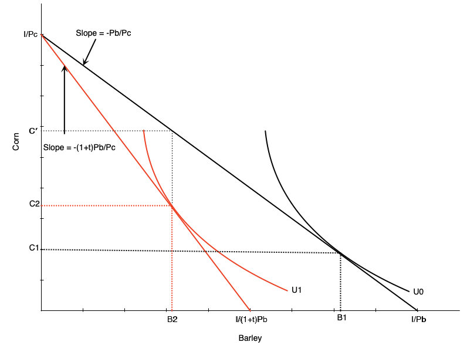
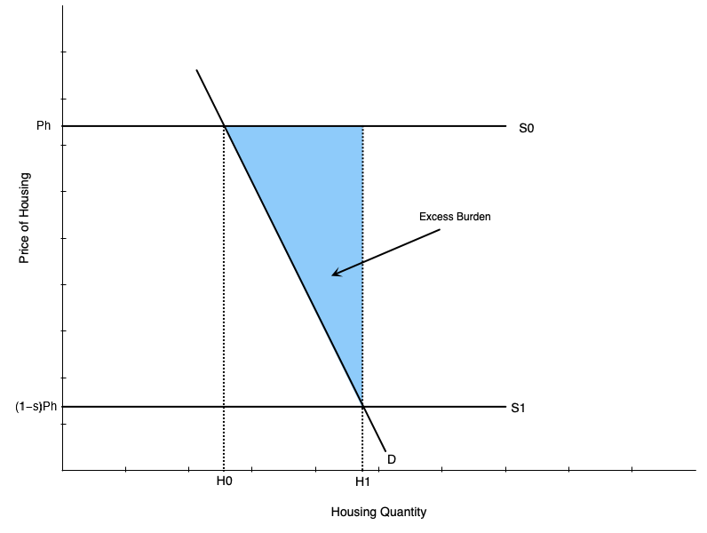
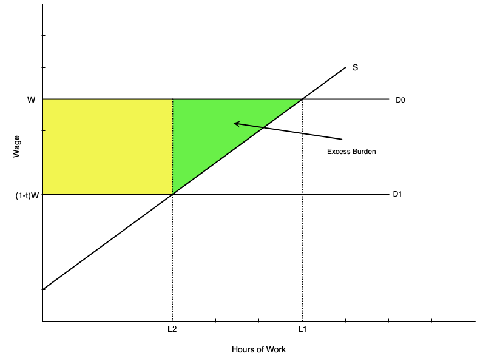

---
format:
  revealjs:
    theme: [default, hygge.scss]
    css: captions.css
    center-title-slide: false
    slide-number: true
    height: 900
    width: 1600
    chalkboard:
      theme: whiteboard
      src: drawings.json
editor: visual
---

<h1>Taxation and Efficiency</h1>

<h2>EC313 - Public Economics: Taxation</h2>

<h2>Justin Smith</h2>

<h2>Wilfrid Laurier University</h2>

<h2>Fall 2026</h2>

{.absolute top="275" left="900" width="550"}

## Goals of This Section

In this section we will:

- Discuss the effects of price changes on consumer behaviour
- Introduce the concept of [excess burden]{.fg style="color: #2780e3;"} of a tax
- Show how to measure excess burden using [indifference curves]{.fg style="color: #2780e3;"}
- Show how to measure excess burden using [demand/supply curves]{.fg style="color: #2780e3;"}
- Show equivalent interpretation with [elasticities]{.fg style="color: #2780e3;"}
- Discuss factors that affect excess burden

# Excess Burden of a Tax with Indifference Curves

## Introduction

- Governments levy taxes mainly to raise revenue to fund public goods and services
- Taxes can impose different types of costs on consumers
  - [Direct cost]{.fg style="color: #555;"}: sending money to the government
  - [Behavioural cost]{.fg style="color: #555;"}: taxes can distort behaviour because of changes in prices
    - Without taxes consumers make choices about consumption
    - Taxes force them to substitute away from the taxed good and make sub-optimal choices
- Ideally a tax imposes the least possible cost in order to raise revenue
  - When the costs are larger, we say there is an [excess burden]{.fg style="color: #c7254e;"}

## Ad Valorem Tax on Consumers

- Below we will see what happens when an [ad valorem tax]{.fg style="color: #2780e3;"} is imposed on one good
  - An ad valorem tax is a percentage tax on the price of a good
  - For example, a 10% sales tax on a \$1 item means the consumer pays \$1.10
- We will use indifference curves and budget constraints to analyze the effects of the tax
- We will then compare to a [lump-sum tax]{.fg style="color: #2780e3;"}

::: {.callout-important}
## Key Insight
[Ad valorem taxes]{.fg style="color: #c7254e;"} that distort behaviour create excess burden. [Lump-sum taxes]{.fg style="color: #5cb85c;"} that do not distort behaviour do not create excess burden. The difference is due to the distortionary effect of changing relative prices with ad valorem taxes.
:::

## Ad Valorem Tax on Consumers

:::::: columns
:::: {.column width="50%"}
::: {layout="[[-1], [1], [-1]]"}

:::
::::

::: {.column width="50%"}
- Graph shows consumption decision for barley and corn
- Initially prices are $P_{B}$ and $P_{C}$
- Budget constraint is $I = P_{B}B + P_{C}C$
- To plot budget constraint, put $C$ on left side

$$C = \frac{I}{P_{C}} - \frac{P_{B}}{P_{C}}B$$

- Slope of budget constraint is $-\frac{P_{B}}{P_{C}}$
- Intercepts are $\frac{I}{P_{C}}$ and $\frac{I}{P_{B}}$
- Optimal consumption bundle is $B_1$ and $C_1$
:::
::::::

## Ad Valorem Tax on Consumers

:::::: columns
:::: {.column width="50%"}
::: {layout="[[-1], [1], [-1]]"}

:::
::::

::: {.column width="50%"}
- An ad valorem tax of $t$ on barley is imposed
- Price of barley rises to $P_{B}(1+t)$
- New budget constraint is $I = P_{B}(1+t)B + P_{C}C$
- Rearranging gives

$$C = \frac{I}{P_{C}} - \frac{P_{B}(1+t)}{P_{C}}B$$

- Slope of new budget constraint is $-\frac{P_{B}(1+t)}{P_{C}}$
- Intercepts are $\frac{I}{P_{C}}$ and $\frac{I}{P_{B}(1+t)}$
- New optimal bundle is $B_2$ and $C_2$
:::
::::::

## Ad Valorem Tax on Consumers

:::::: columns
:::: {.column width="50%"}
::: {layout="[[-1], [1], [-1]]"}

:::
::::

::: {.column width="50%"}
- Vertical distance between budget lines is [tax collected]{.fg style="color: #2780e3;"}
- On the old budget line if consumer buys $B_2$ barley, corn consumption is

$$C^{'} = \frac{I}{P_{C}} - \frac{P_{B}}{P_{C}}B_2$$

- On the new budget line if consumer buys $B_2$ barley, corn consumption is

$$C_{2} = \frac{I}{P_{C}} - \frac{P_{B}(1+t)}{P_{C}}B_2$$
:::
::::::

## Ad Valorem Tax on Consumers

:::::: columns
:::: {.column width="50%"}
::: {layout="[[-1], [1], [-1]]"}

:::
::::

::: {.column width="50%"}
- Difference is

$$C^{'} - C_{2} = \frac{P_{B}t}{P_{C}}B_2$$

- Measures reduction in corn consumption due to tax
- To measure in dollar terms

$$P_{C}(C^{'} - C_{2}) = tP_{B}B_2$$

- This is the tax rate times the value of barley consumed
:::
::::::

## Equivalent Variation

:::::: columns
:::: {.column width="50%"}
::: {layout="[[-1], [1], [-1]]"}

:::
::::

::: {.column width="50%"}
- As a comparison, consider leaving prices unchanged and reducing income to reach the same utility as we got with the tax
  - This income reduction is the [**equivalent variation**]{.fg style="color: #2780e3;"}
- Shift the original budget line parallel in until it is tangent to the new indifference curve
- Distance between the original and new budget lines is the equivalent variation
:::
::::::

## Excess Burden

:::::: columns
:::: {.column width="50%"}
::: {layout="[[-1], [1], [-1]]"}

:::
::::

::: {.column width="50%"}
- The [**excess burden**]{.fg style="color: #c7254e;"} of a tax is the loss in welfare beyond the tax revenue collected
- In the graph it is the difference between the equivalent variation and the tax revenue collected
  - [Equivalent variation]{.fg style="color: #555;"}: measures loss in welfare (distance in green)
  - [Tax revenue]{.fg style="color: #555;"}: money collected by government (distance between black and red budget lines)
- In this case, equivalent variation is larger than tax revenue
  - So there is a [positive excess burden]{.fg style="color: #c7254e;"} (in purple)
:::
::::::

## Excess Burden

- An ad valorem tax on one good creates two effects
  1. [Income effect]{.fg style="color: #2780e3;"}: consumer is poorer, so consumes less of all normal goods
  2. [Substitution effect]{.fg style="color: #2780e3;"}: relative price of taxed good rises, so consumer substitutes away from taxed good
- [Excess burden]{.fg style="color: #c7254e;"} arises because of the substitution effect
  - Consumer substitutes away from taxed good to other goods
  - This leads to a loss in welfare beyond the tax revenue collected
- One way to see this is to compare an ad valorem tax to a lump-sum tax
  - [Lump-sum tax]{.fg style="color: #5cb85c;"} only has income effect, no substitution effect
  - So [no excess burden]{.fg style="color: #5cb85c;"}

## Lump Sum Tax

:::::: columns
:::: {.column width="50%"}
::: {layout="[[-1], [1], [-1]]"}

:::
::::

::: {.column width="50%"}
- A [lump-sum tax]{.fg style="color: #2780e3;"} $T$ is imposed
- New budget constraint is $I -T = P_{B}B + P_{C}C$
- Rearranging gives

$$C = \frac{I-T}{P_{C}} - \frac{P_{B}}{P_{C}}B$$

- Budget line shifts down in parallel by $T$
  - Prices do not change, so slope does not either
- New optimal bundle is $B_3$ and $C_3$
:::
::::::

## Lump Sum Tax

:::::: columns
:::: {.column width="50%"}
::: {layout="[[-1], [1], [-1]]"}

:::
::::

::: {.column width="50%"}
- Tax revenue is $T$
  - Does not depend on how much of each good is consumed
- Equivalent variation is also $T$
  - Distance between original and new budget lines is $T$
- So there is [no excess burden]{.fg style="color: #5cb85c;"}
  - Welfare loss equals tax revenue collected
- Arises because a lump sum tax is a pure income effect
  - No substitution effect, so no excess burden
:::
::::::

# Challenges with Excess Burden

## Efficiency

- If lump sum taxes do not create excess burden, why not use them?
- Often they are unattractive politically
  - A fixed tax on everyone is viewed as [unfair]{.fg style="color: #c7254e;"}
  - It is also [regressive]{.fg style="color: #c7254e;"}
- There are few examples in the world
  - UK had a poll (head) tax in the late 80s that was unpopular
  - Some municipal governments charge fixed fees for licenses/permits
- So governments widely use [distortionary taxes]{.fg style="color: #c7254e;"} instead

## Income taxes

- Income taxes can also involve [excess burdens]{.fg style="color: #c7254e;"}
- Income taxes distort labour supply decisions
  - Higher tax rates reduce the after-tax wage
  - This causes people to substitute away from labour towards leisure
  - This is a [substitution effect]{.fg style="color: #2780e3;"} that creates excess burden
- Like with goods, income taxes change relative prices, and therefore behaviour
- Changes the price of leisure relative to consumption

## Excess Burden with Inelastic Demand

- Suppose that a tax is introduced on barley, but barley consumption does not change
- Does this mean there is no excess burden?

::: {.callout-warning}
## Common Misconception
The answer is **no** — even with inelastic demand for the taxed good, there is still excess burden. The consumer faces different relative prices, which distort the consumer's choices across *all* goods, leading to inefficiency.
:::

## Excess Burden with Inelastic Demand

:::::: columns
:::: {.column width="50%"}
::: {layout="[[-1], [1], [-1]]"}

:::
::::

::: {.column width="50%"}
- Graph looks similar to before
- This time barley consumption stays constant
- Corn consumption rises due to relatively lower price
- Excess burden is about the change in the consumption *bundle*
  - Not just the change in quantity of one good
:::
::::::

# Excess Burden with Demand Curves

## Aside: Compensated vs Ordinary Demand Curves

- A demand curve measures the change in quantity demanded as price changes

:::: columns
:::: {.column width="50%"}
::: {.callout-note}
## Ordinary (Marshallian) Demand
Measures the **total** change in quantity demanded as price changes. Includes both [income]{.fg style="color: #2780e3;"} and [substitution]{.fg style="color: #2780e3;"} effects.
:::
::::

:::: {.column width="50%"}
::: {.callout-note}
## Compensated (Hicksian) Demand
Measures the change in quantity demanded as price changes, **holding utility constant**. Only includes the [substitution effect]{.fg style="color: #2780e3;"}. Can hold utility constant at initial level or new level.
:::
::::
::::

- Excess burden is related to the substitution effect, so we use [compensated demand curves]{.fg style="color: #2780e3;"}

## Aside: Compensated vs Ordinary Demand Curves

:::::: columns
:::: {.column width="50%"}
::: {layout="[[-1], [1], [-1]]"}

:::
::::

::: {.column width="50%"}
- Consider a tax on barley
  - Price of barley rises from $P_{B}$ to $P_{B}(1+t)$
- The [ordinary demand curve]{.fg style="color: #2780e3;"} measures change from old equilibrium at old prices to new equilibrium at new prices
  - Includes both income and substitution effects
- The [compensated demand curve]{.fg style="color: #2780e3;"} starts from the new utility level at old prices, then traces to the new equilibrium at new prices
  - Only includes substitution effect
- The drop in demand is larger for ordinary demand
:::
::::::

## Aside: Compensated vs Ordinary Demand Curves

:::::: columns
:::: {.column width="50%"}
::: {layout="[[-1], [1], [-1]]"}

:::
::::

::: {.column width="50%"}
- Demand curve is plot of price vs quantity demanded
- On left we plot price before and after tax against quantities
- Drop in quantity is larger for ordinary demand curve
  - Includes both income and substitution effects
  - So ordinary demand curve is flatter
- Compensated demand curve is steeper because it only includes substitution effect
:::
::::::

## Excess Burden with Demand Curves

- [Excess burden]{.fg style="color: #c7254e;"} of a tax is related to the substitution effect
- We can use compensated demand curve to measure it
- Recall that it is loss in welfare beyond tax revenue collected
- The loss in welfare to the consumer is measured by the drop in [consumer surplus]{.fg style="color: #2780e3;"}
  - This is the area under the compensated demand curve between old and new prices
- Part of that loss is [tax revenue]{.fg style="color: #5cb85c;"} collected
  - This is the rectangle with height equal to the tax and width equal to new quantity
- The other part is [lost entirely]{.fg style="color: #c7254e;"} to the consumer
  - This is the excess burden

## Excess Burden with Demand Curves

:::::: columns
:::: {.column width="50%"}
::: {layout="[[-1], [1], [-1]]"}

:::
::::

::: {.column width="50%"}
- Imagine a tax is imposed on barley
- Supply is perfectly elastic
  - So economic incidence falls entirely on consumers
- Price rises from $P_{B}$ to $P_{B}(1+t)$
- Compensated quantity demanded falls from $B_{3}$ to $B_{2}$
- [Tax revenue]{.fg style="color: #5cb85c;"} is green rectangle
- Total fall in consumer surplus is green + blue areas
- [Excess burden]{.fg style="color: #c7254e;"} is blue area
:::
::::::

# Excess Burden with Elasticities

- We can translate the excess burden area into a formula using [elasticities]{.fg style="color: #2780e3;"}
- The excess burden is the blue triangle
- Area of triangle is $\frac{1}{2} \times \text{base} \times \text{height}$
  - [Base]{.fg style="color: #555;"}: change in quantity: $\Delta B = B_{3} - B_{2}$
  - [Height]{.fg style="color: #555;"}: tax: $tP_{b}$
- The definition of elasticity at the original equilibrium is

$$\eta = \frac{\Delta B}{\Delta P} \times \frac{P_b}{B_3}$$

# Excess Burden with Elasticities

- Rearranging gives

$$\Delta B = \eta \times \frac{\Delta P}{P_b} \times B_3$$

- In our case, $\Delta P = tP_{b}$, so

$$\Delta B = \eta \times t \times B_{3}$$

- The area is then

$$\text{Excess Burden} = \frac{1}{2} \times (\eta \times t \times B_{3}) \times (tP_{b}) = \frac{1}{2} \times (\eta\times B_{3}) \times (t^2 P_{b}) $$

# Excess Burden with Elasticities

::: {.callout-important}
## Excess Burden Formula
$$\text{Excess Burden} = \frac{1}{2} \times (\eta\times B_{3}) \times (t^2 P_{b}) $$
:::

- Excess burden depends on three things
  1. [Size of tax]{.fg style="color: #2780e3;"} $t$
    - Excess burden rises with square of tax rate
  2. [Elasticity of demand]{.fg style="color: #2780e3;"} $\eta$
    - More elastic demand means larger excess burden
  3. [Initial spending]{.fg style="color: #2780e3;"} $P_{b}B_{3}$
    - Larger initial spending means larger excess burden

# Additional Considerations for Excess Burden

## Pre-existing Distortions

- In the real world, there are many taxes and regulations that distort behaviour
- If a new tax is introduced, it may interact with these [pre-existing distortions]{.fg style="color: #2780e3;"}
  - Pre-existing distortions include monopoly power, externalities, and other taxes
- Having pre-existing distortions complicates the analysis of excess burden
  - A new tax may [increase]{.fg style="color: #c7254e;"} or [decrease]{.fg style="color: #5cb85c;"} overall excess burden
  - Depends on how it interacts with pre-existing distortions

::: {.callout-note}
## Theory of the Second Best
If the economic optimum cannot be achieved (due to existing distortions), the next best solution may involve introducing additional distortions.
:::

## Pre-existing Distortions

- Example 1: pre-existing tax on good A
  - This tax distorts consumption away from good A
  - Introducing a tax on good B may lead consumers to substitute towards good A
  - This can [reduce]{.fg style="color: #5cb85c;"} the excess burden on good A by increasing its consumption
  - Overall excess burden may increase or decrease because of the new tax on good B

## Pre-existing Distortions

- [Example 2: Minimum Wages]{.fg style="color: #2780e3;"}
  - A labour market monopsony leads to lower wages and employment than in a competitive market
  - Imposing a minimum wage can [increase employment]{.fg style="color: #5cb85c;"} and reduce the excess burden caused by monopsony power
- [Example 3: Externalities from Carbon]{.fg style="color: #2780e3;"}
  - A country has a negative externality from emissions and cannot impose a carbon tax
  - The next best outcome might involve subsidies for renewable energy, even if they distort energy markets
- General lesson is that impact of tax is not limited to the market it directly affects
  - Overall excess burden depends on interactions with other markets and distortions

## Excess Burden of a Subsidy

- A [subsidy]{.fg style="color: #2780e3;"} is a negative tax
  - It lowers the price paid by consumers or received by producers
- Problem is that it can lead to [over-consumption]{.fg style="color: #c7254e;"} or [over-production]{.fg style="color: #c7254e;"}
  - This creates inefficiencies and excess burden
- A subsidy will [increase welfare]{.fg style="color: #5cb85c;"} (consumer surplus) but the cost to the government may exceed this increase
  - The difference is the [excess burden]{.fg style="color: #c7254e;"} of the subsidy

## Excess Burden of a Subsidy

:::::: columns
:::: {.column width="50%"}
::: {layout="[[-1], [1], [-1]]"}

:::
::::

::: {.column width="50%"}
- Picture a housing subsidy
- Prior to subsidy, optimal consumption is $H_0$ at price $P_h$
- Subsidy lowers price to $(1-s)P_h$
- New optimal consumption is $H_1$
- [Cost of subsidy]{.fg style="color: #555;"} is green plus blue rectangle
- [Increase in consumer surplus]{.fg style="color: #5cb85c;"} is green area
- [Excess burden]{.fg style="color: #c7254e;"} is blue triangle
:::
::::::

## Excess Burden of Income Tax

- Income taxes distort [labour supply]{.fg style="color: #2780e3;"} decisions
  - Higher tax rates reduce the after-tax wage
  - This causes people to substitute away from labour towards leisure
  - This is a [substitution effect]{.fg style="color: #2780e3;"} that creates excess burden

## Excess Burden of Income Tax

:::::: columns
:::: {.column width="50%"}
::: {layout="[[-1], [1], [-1]]"}

:::
::::

::: {.column width="50%"}
- Imagine a labour market with elastic labour demand
  - So a tax on labour is borne entirely by workers
- An income tax shifts down labour demand curve from $D_0$ to $D_1$
  - Reduces wage from $W$ to $(1-t)W$
- Initially worker surplus is area below demand curve and above supply
- After tax, surplus falls by yellow plus green areas
:::
::::::

## Excess Burden of Income Tax

:::::: columns
:::: {.column width="50%"}
::: {layout="[[-1], [1], [-1]]"}

:::
::::

::: {.column width="50%"}
- Some of the fall is collected by government as [tax revenue]{.fg style="color: #5cb85c;"}
  - This is yellow rectangle
- The green triangle is [lost entirely]{.fg style="color: #c7254e;"}
  - This is the excess burden
- Result is very similar to excess burden from a tax on goods
  - Except here the tax is on wages and workers are suppliers
:::
::::::

## Excess Burden of Income Tax

::: {.callout-important}
## Excess Burden of Income Tax Formula
$$\text{Excess Burden} = \frac{1}{2} \times (\epsilon \times L_{0}) \times (t^2 W) $$
:::

- Where $\epsilon$ is the elasticity of labour supply
- Excess burden depends on
  1. [Size of tax]{.fg style="color: #2780e3;"} $t$
    - Excess burden rises with square of tax rate
  2. [Elasticity of labour supply]{.fg style="color: #2780e3;"} $\epsilon$
    - More elastic labour supply means larger excess burden
  3. [Initial earnings]{.fg style="color: #2780e3;"} $WL_{0}$
    - Larger initial earnings means larger excess burden

# Summary

## Summary

- Taxes are used in part to raise revenue for the government
- They impose a [direct cost]{.fg style="color: #555;"} to consumers of the tax revenue collected
- But they also distort behaviour and create an [excess burden]{.fg style="color: #c7254e;"}
  - Loss in welfare beyond tax revenue collected
- Excess burden arises from the [substitution effect]{.fg style="color: #2780e3;"} of a tax
- The size of the excess burden depends on [pre-existing distortions]{.fg style="color: #2780e3;"}
- [Theory of the Second Best]{.fg style="color: #2780e3;"} says that when distortions exist, best outcome may involve additional distortions

# References

## References

-   Rosen, Harvey S., and Lindsay M. Tedds, and Trevor Tombe, and Jean-Francois Wen, and Tracy Snoddon. Public Finance in Canada. 6th Canadian edition. McGraw-Hill Ryerson, 2023.

-   Gruber, Jonathan. Public Finance and Public Policy. 7th edition. Worth Publishers, 2022.
